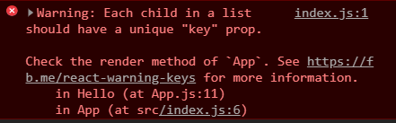

 What is React!
 ==============================
react를 공부하는 가장 기초적인 학습!
-----------------------------------

<hr/>

### REACT란?
- 리액트는 페이스북에서 제공해주는 프론트엔드 라이브러리
- 리액트는 컴포넌트 기반으로 되어있어서 컴포넌트에 데이터를 내려주면 개발자가 설계한대로 UI가 만들어져 사용자에게 제공
- 리액트는 컴포넌트를 개발하는것!! 모든 것이 컴포넌트로 구성
- 컴포넌트를 구현하고 Virtual DOM으로 실행
- 실행된 내용을 실제 DOM에 올리는 구조가 리액트
    + 컴포넌트란?
        * 모듈 내에서 재사용이 가능한 최소 단위
            - 모듈이란?
                * 특정 기능을 온전히 수행할 수 있도록 만들어진 단위
        * 쉽게 풀어서 HTML을 반환하는 함수!
- 라액트의 데이터 흐름은 한 방향으로 진행
    + 위에서 아래로 흐르는 데이터 흐름을 역전시키기 위해서는 특별한 코드를 사용해야함
- Props , State
    + Props란?
        * 부모 컴포넌트에서 자식 컴포넌트로 전달해 주는 데이터
        * 읽기 전용 데이터
        * 자식 컴포넌트에서 전달 받은 props 변경 불가
        * 최상위 부모 컴포넌트만 Props를 변경할 수 있음
    + State란?
        * 동적인 데이터를 다룰 때 사용
        * 사용자와 상호작용을 통해 데이터를 동적으로 변경해야 할 때 사용
        * State는 클래스형 컴포넌트에서만 사용
        * 각각의 State는 독립적이라 다른 컴포넌트의 직접적인 접근 불가
        * 자신보다 상위에 있는 State는 변경이 가능
        * State를 변경하는 함수를 Props로 받는다면 State 변경 가능
- Virtual DOM
    + 가상의 Document Object Model
    + 실제 DOM에서 이벤트들을 적용시키기 전에 Virtual DOM을 만들어 적용시킴
    + 변경된 부분만 실제 DOM에 반영

- JSX란?
    + javascript와 html 사이의 조합
    + 리액트에서만 사용하는 유일한 개념
    + Javascript안의 HTML

<hr/>

### react의 실행구조
- react에서 작성한 내용들은 index.html파일의 div태그 안에 주입된다. 주입된 내용들이 우리가 보는 화면!! 
- react는 소스코드에 처음부터 HTML을 넣지 않고, HTML에서 HTML을 추가하거나 제거함!
    + 빈 HTML안에 react로 작성된 Component들을 주입해서 실행시킴!


##### APP.js
```
import React from 'react';

function App() {
  return <div className="App">Hello World</div>;
}

export default App;
```
- 여기서 작성된 내용은 className="APP"을 통해 index.js로 보내진다.

##### index.js 
```
import React from 'react';
import ReactDOM from 'react-dom';
import App from './App';


ReactDOM.render(
  <React.StrictMode>
    <App />
  </React.StrictMode>,
  document.getElementById('root')
);

```
- index.js파일에서는 APP.js에서 작성했던 functiond을 불어와서 REACTDOM으로 실행시킨다.


##### index.html
```
   <title>React App</title>
  </head>
  <body>
    <noscript>You need to enable JavaScript to run this app.</noscript>
    <div id="root"></div>
```
- index.js에서 불러온 app.js의 내용들을 index.html에 주입한다!

### Component를 만드는 방법
- src 폴더 아래에 새로운 js파일을 생성!
```
import React from 'react';
```
위의 코드를 추가하지 않으면 리액트는 해당 js의 컴포넌트를 인식하지 못합

##### Hello.js
```
import React from 'react';

function Hello(){
    return <h3>동건이의 리엑트 도전</h3>;
}

export default Hello;
```
- 기본적인 컴포넌트를 생성하는 방식!
- function을 제작한 이후에는 export를 통해 Hello컴포넌트를 등록해야함!

##### index.js
```
import React from 'react';
import ReactDOM from 'react-dom';
import App from './App';
import Hello from './Hello';


ReactDOM.render(
  <React.StrictMode>
    <Hello />
  </React.StrictMode>,
  document.getElementById('root')
);
```
- App 컴포넌트 대신에 Hello 컴포넌트를 삽입

#### 주의사항 
- react application은 하나의 Component만을 rendering함!
```
import React from 'react';
import ReactDOM from 'react-dom';
import App from './App';
import Hello from './Hello';


ReactDOM.render(

    <App/>
    <Hello />
 ,
  document.getElementById('root')
);
```
- 위의 코드처럼 두개의 컴포넌트를 연관성 없이 실행하는 것은 오류 발생!
    + 이를 해결하기 위해서 컴포넌트 안에 컴포넌트를 실행!


- 컴포넌트 생성을 간단하게 하는 방법 1
```
import React from 'react';

export default () =><div>Hello World</div>;
```

- 컴포넌트 생성을 간단하게 하는 방법 2
```
import React from 'react';

export default () =>(<div>Hello World</div>);
```

- 컴포넌트 생성을 간단하게 하는 방법 3
```
import React from 'react';

export default () =>{
    return <div>Hello World</div>
    };
```
- 만약 하나의 js파일에 여러개의 컴포넌트를 생성하고 싶으면?
```
export default App;
export default Hello;
```
- 하나의 파일에 여러 컴포넌트를 생성할 경우에 다른 파일에서 해당 컴포넌트를 주입시키기 위해서는 아래의 구조를 따른다.
```
import {App} from './App';
```
- 그러나 위의 export 방식은 선호하는 방식이 아님

```
export default Hello =() => {
  return (
    <div >
    Hello World
</div>
  )
};
```
- export를 하는 동시에 선언함

- 주의사항
    + () -> return X
    + {} -> return O


### 질문사항/
-  <React.StrictMode>?
```
<React.StrictMode>
    <Hello />
    <App />
  </React.StrictMode>
```
- 이런 경우는 왜 두개의 컴포넌트 모두 실행 가능한 것인가?
    + 리엑트에서 컴포넌트를 랜더링 할때는 하나의 컴포넌트만 가능하다.
```
ReactDOM.render(

    <App/>
    <Hello />
 ,
  document.getElementById('root')
);
```
- 위의 코드처럼 두개의 컴포넌트를 랜더링할 수 없다. 이런 이유로 2개 이상의 컴포넌트를 랜더링할 때는 태그를 사용해서 묶는다.
```
ReactDOM.render(
<>
    <App/>
    <Hello />
</>
 ,
  document.getElementById('root')
);
```
- 리엑트가 하나의 컴포넌트로 인식할 수 있게 태그로 묶는다!

<hr />

### Component에서 Component (정적)
- App Component에서 Hello Componet로 정보를 보내고 Hello Component에서 받은 정보를 사용하는 방법 
- App Component는 부모 Component이다!. App Component에서 보낸 props를 Hello Component 받을 수 있다. 밑의 코드를 확인하자!
```
import React from 'react';

function Hello(props){
  console.log(props);
  return <h1>동건이의 리엑트 도전기</h1>;
}

function App() {
  return (<div ><h1>Hello World</h1>
  <Hello hello ="hye" something={true} something2={["heeee",1,2,3,4,5,5]} />
  </div>);
}
export default App;

```
- < Hello 뒤에 붙은 코드들이 props로 Hello Component로 전달된다. 이걸 받기 위해서는 function Hello(props)를 사용한다.
- console.log(props)를 사용해서 전달받은 props를 확인할 수 있다.
    + console.log(props)를 확인하면 object에 전달받은 props를 확인할 수 있다.
    + 이러한 기술이 react magic 이다.
#### object에서 hello의 값을 꺼내고 싶으면? 방법1
```
function Hello(props){
  console.log(props.hello);
  return <h1>동건이의 리엑트 도전기</h1>;
}
```
- props.object이름을 추가하자!

#### object에서 hello의 값을 꺼내고 싶으면? 방법2
```
function Hello({ hello }){
  console.log(hello);
  return <h1>동건이의 리엑트 도전기</h1>;
}
```

#### 부모 Component에서 전달받은 props를 자식 Component에서 받아서 사용하고 싶으면?
```
function Hello({ hello }){
  return <h1>{ hello } 동건이의 리엑트 도전기</h1>;
}
```
- {} 중가로 안에 props의 이름을 추가하면 데이터 값을 불러올 수 있다.!

### 동적으로 props를 전달하는 방법
- Component에서 Component (동적)
```
import React from 'react';

function Hello({ name,id}){
return <h1>{ name } 동건이의 리엑트 도전기{id}</h1>;
}

const say = [{name: "hello", id: "1"},{name:"zeronimo", id: "2"},{name: "good",id:"3"},{name:"bye",id:"4"}]

function App() {
  return (
  <div ><h1>Hello World</h1>
 {say.map(what => <Hello name={what.name} id={what.id}/>)}
  </div>);
}
export default App;
```
- map은 배열에 있는 값을 순차적으로 가져오는 기능을 제공함
    + map이란?
        * map() 함수는 각 배열의 요소를 돌면서 인자로 전달된 함수를 사용하여 처리 된 새로운 결과를 새로운 배열에 담아 반환하는 함수
        * map은 각각 item 별로 props를 반환
- 기본구조
```
배열이름.map(원하는 명칭 => <컴포넌트이름 오브젝트 명칭={원하는명칭.오브젝트 명칭}/>)
```
- map은 react에서 많이 쓰이는 함수이므로 반복적인 학습이 중요!

#### function을 활용해서 map의 object를 props로 보내자!
```
import React from 'react';

function Hello({ name,id}){
return <h1>{ name } 동건이의 리엑트 도전기{id}</h1>;
}

const say = [{name: "hello", id: "1"},{name:"zeronimo", id: "2"},{name: "good",id:"3"},{name:"bye",id:"4"}]

function rendersay(word){
  console.log(word);
  return <Hello name={word.name} id={word.id} />
}

function App() {
  return (
  <div >
 {say.map(rendersay)}
  </div>);
}
export default App;
```
- 구조는 간단함!
    + 부모 컴포넌트 -> 함수 -> 자식 컴포넌트
    + 위의 방식은 부모 컴포넌트와 자식 컴포넌트에 부담을 줄인다!

- key값의 중복으로 발생하는 오류잡기!

### 부모 Component로 부터 받은 props가 제대로 전달되었는지 확인하는 방법
- prop가 알맞게 전달되었는지 확인하는 방법!!
    + prop-types를 통해 props가 알맞은 type을 가졌는지 확인!
```
Hello.propTypes = {
  name: PropTypes.string.isRequired,
  id: PropTypes.string.isRequired,
  idw: PropTypes.string.isRequired,
  rating: PropTypes.string.isRequired
};
```
- 본인이 원하는 자료형으로 props가 전달되었는지 확인할 수 있다.!

#### es6란?
- JavaScript의 최신버전
<hr />

### 동적으로 state 전달하는 방법
- state란?
    + state는 object
    + 동적인 데이터와 함께 작업 중 생성
    + 변하는 데이터, 존재하지 않은 데이터 등
    + 기존읜 App.js에서 props를 사용하기 위해 썼던 문법과 state를 사용하기 위한 문법은 다름
- Function Component와 Class Component
    - Function component란? 
    
    ex
    ```
    function Welcome(props) {
    return <h1>Hello, {props.name}</h1>;
    }
    ```
      + props를 객체 인자로 받아 리엑트 엘리먼트를 반환

    - Class Component란? 
      + state를 사용
      + life cycle method를 통해 react가 component를 생성하고 삭제하는 방법
    ex
    ```
    class Welcome extends React.Component {
    render() {
    return <h1>Hello, {this.props.name}</h1>;
    }
    }
    ```
      + react.component로 확장된 class component는 자동으로 render()를 실행

    - state를 사용해서 object값을 바꾸는 방법!

```
import React from 'react';

class App extends React.Component{
  state = {
    count: 0
  };
  add = () => {
    this.setState({
      count: this.state.count + 1
    })
  };
  minus = () => {
    this.setState({
      count: this.state.count - 1
    })
  };
  render(){
  return(
  <div>
<h1>i am class component{this.state.count}</h1>
<button onClick={this.add}>Add</button>
  <button onClick={this.minus}>Minus</button>
  </div>
  );
}
}

export default App;
```

- setState를 사용해서 state의 값을 동적으로 바꿀 수 있음
    - setState란?
        + setState는 class Component에서 새로운 state와 render()를 자동으로 호출해주는 역할을 함!
- setState를 호출하지 않을 경우?
    - `this.statecount = 4`로 지정을 했어도 react는 render를 수행하지 않으므로 값이 변경되지 않음!

- this.state.count로 state의 값을 가져오는 방법이 불편하다면?

```
import React from 'react';

class App extends React.Component{
  state = {
    count: 0
  };
  add = () => {
    this.setState(current => ({
      count: current.count + 1
    }))
  };
  minus = () => {
    this.setState(current => ({
      count: current.count - 1
    }))
  };
  render(){
  return(
  <div>
<h1>i am class component{this.state.count}</h1>
<button onClick={this.add}>Add</button>
  <button onClick={this.minus}>Minus</button>
  </div>
  );
}
}

export default App;
```

- current를 통해서 count의 값을 가져올 수 있다!
    + function을 이용하는 방법!
    + react는 current를 해석할 수 있음!

#### life cycle method
- react에서 기본적으로 component를 생성하고 삭제하는 기능
  - mounting : 컴포넌트 생성
    + constructor() -> javascript에서 다른 class를 생성할때 호출되는 것
      * componet의 생성, 화면표시, web응답할 때 사용됨
    + render() : component가 render될 때
    + componentDidMount() : component가 처음 render된것을 알려줌
  - updating : 컴포넌트 업데이트
    + render() : component가 render될 때
    + componentDidUpdate() : 업데이트가 완료되면 실행!
  - unmounting : 컴포넌트 종료
    + componentWillUnmount : 컴포넌트가 종료되었을때 실행!

#### render()란?
  + 리엑트에서 사용하는 유일한 function
  + render()에서 새로운 엘리먼트 트리 생성
  + 이전 엘리먼트 트리와 비교해서 차이점을 확인하고 업데이트
      - 엘리먼트란?
          + 하나의 객체를 의미함
          ```
          cost element ={};
          ```
      - 모든 엘리먼트는 react dom에서 관리 => root dom

#### function component와 class component의 차이점
      + Function Component보다 더 많은 기능을 재공
      + 그러나 props 재사용으로 인해 문제가 말생하기도 함!
      + class component는 react component로부터 확장됨
      + class component는 state를 사용할 수 있음
          - 그러나 현잰 hooks가 있기에 function도 이를 사용 가능
### 주의!
- js는 인터프리터 언어이다. 그러므로 위에서 아래로 향하는 상하관계를 갖는 구조를 갖는다!!
    + 오류가 발생할 경우에 위에서 부터 차근차근 확인!!
- Component는 대문자로 시작해야함!!
- react의 모든 element는 다르게 해야함!

    + key Error를 해결하기 위해서는 해당 Element에 독립적인 요소들이 존재하면 됨!


- 3부터 다시 시작!